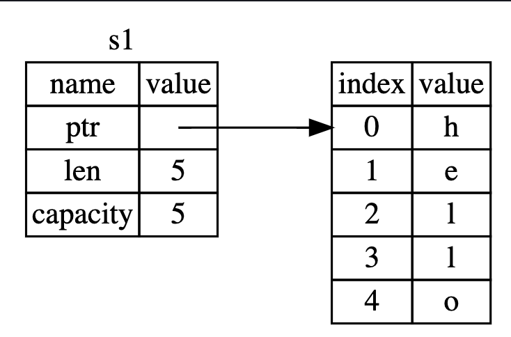

# Rust PlayGround

---

### This README.md contained Korean translated content of [official site](https://doc.rust-lang.org/book/)

---

# Variables in Rust

`mut` 키워드는 변경 가능한 값을 의미한다.

```rust
let mut x = 5;
x = 10 //ok

let y = 5
y = 10 // unavailable

```

`const` 는 변경불가능한 상수를 뜻한다.

```rust
const x : u32 = 60 * 60 * 3;
x = 2345 //unavailable
```

## Shadowing

위에서 선언했던 변수와 같은 이름으로 아래에서 선언되어 사용되어지는 것을
러스트 이용자들(Rustaceans)은 섀도잉 이라고 부른다.

```rust
let x = 5;

let x = x + 1; // 6

{
    let x = x * 2; //12
    println!("The value of x in the inner scope is: {x}");
}

println!("The value of x is: {x}"); //6

```

새로운 블럭 내에서 위의 x를 이용해서 let키워드로 x를 재정의 해 사용하는 것을 볼 수 있다.  
그렇게 선언된 x는 종속된 코드블럭 내에서 유효하며, 범위를 벗어나면 다시 원래의 x값을 가지게 된다.  
사실상 컨텍스트 스위칭에 의한 새로운 변수로 볼 수 있겠다.

새도잉은 변수를 mut 키워드를 사용해 정의 하는것과는 다르다.  
우리는 `let` 키워드를 사용하지 않고 갑자기 다른 값을 할당하려고 한다면 컴파잍타임 에러를 불러 일으킨다.

let을 이용하면, 우리는 몇몇 가자의 값의 변환을 할 수 있지만, 섀도잉이 끝난 이후의 변수는 불변상태(immutable) 상태가 된다.

<br>

# Data Type in Rust

러스트의 모든 값은 자료형을 가지게 된다.  
이것은 러스트에게 어떤 종류의 데이터가 확정되어지는 지 알려주며, 이것은 데이터와 어떻게 작업 될 지 알 수 있다.

우리는 여기서 크게 두가지 자료형 부분집합 `Scalar`와 `Compound`를 알아볼 것이다.

일단 러스트는 정적 타입언어임을 항상 머릿속에 기억하는 것이 좋다.  
이것은 컴파일 타임에 모든 자료형을 알아야만 한다는 것을 뜻한다.  
컴파일러는 실제 값과, 우리가 어떻게 사용하는지를 바탕으로 우리가 어떻게 사용하고싶은가를 대개 유추할 수 있다.

여러 자료형이 가능할 경우, (예를 들어 우리가 문자열 자료형을 parse 를 통해 숫자자료형으로 바꾸는 때와 같이), 우리는 다음과 같이 타입 설정을 반드시 해주어야 한다.

```rust

let guess: u32 = "42".parse().expect("Not a number!");

```

## Scalar Types

스칼라 자료형은 기본적으로 단일 값을 표현한다. 러스트는 4개의 원시 스칼라 자료형을 지원한다.

- integer
- float-point number
- boolean
- characters

만약 이것에 대해서 다른 프로그래밍 언어에서 본 적이 있어 익숙하다면 이것들이 어떻게 러스트에서 쓰이는지 알아보도록 하자.

### 정수 자료형


정수 자료형은 명시적인 크기를 가지며, 부호가 있을 수도 없을 수도 있습니다.

이 때, `isize`, `usize` 타입들은 은 당신의 프로그램이 돌아가는 컴퓨터의 구조에 따라 달라질 수 있다.  
당신이 64비트 컴퓨터를 사용 할 경우 i/u64, 32비트 컴퓨터의 경우 i/u32 의 메모리를 할당받개 된다. ㄴ

정수 데이터를 명시, 표기 할 때 여러 방식으로 표기할 수 있다.  
이것을 정수 리터럴(Integer literal) 이라고 하며 다음과 같이 표기할 수 있다.  
(이 때, 여러 숫자 유형이 될 수 있다면, `58u8` 과 같이 유형 접미사를 허용함.)  
뿐만아니라 숫자를 읽기 쉽도록 `_` (언더바) 로 구분할 수 있다.


정수 유형의 기본 값은 i32 이며,`isize`, `usize` 등을 사용하는 주요 상황은 어떤 컬렉션을 인덱싱 할 때 이다.

### 부동 소수점 자료형

러스트는 물론 두개의 부동 소수점 자료형을 지원합니다. 십진수 소수점을 가짐.  
`f32`, `f64` 두가지 자료형을 지원하며, 기본은 `f64` 를 사용.  
최근 CPU 는 처리속도는 비슷하지만 정확도가 더 높기 때문.

모든 숫자 자료형의 사칙연산은 C의 사칙연산과 같음

- / : 몫을 반환
- % : 나머지 반환

### 불리언 자료형

다른 프로그래밍 랭귀지 처럼 러스트도 불리언 타입을 지원.  
1바이트의 사이즈를 가지며, 타입을 명시할 시 `bool` 키워드를 사용.

```rust

let mut t : bool = true;
```

### 캐릭터 자료형(문자)

작은 따옴표로 리터럴 지정합니다. 크기가 4바이트. (기존 C와 같은 언어는 1바이트)  
유니코드 스칼라 값을 가지기 때문에 이모티콘 같은 것들, 한국어, 일본어 등을 지원.

## Compound Types

- Tuple
- Array

### Tuple

튜플은 다영한 여러 유형의 값을 하나로 그롭화 하는 일반적 방법

```rust
let tup: (i32, f64, u8) = (500, 6.4, 1);

```

튜플은 단일 복합요소로 간주되어, tup 라는 변수에 바인딩 됨.  
따라서 별개의 밧을 얻고 싶은 경우 다음과 같은 매칭 패턴을 사용할 수 있음.

```rust
let tup = (500, 6.4, 1);
let (x, y, z) = tup;
println!("The value of y is: {y}");

```

자바스크립트에서의 일종의 구조분해할당(비구조화 문법) 을 생각할 수 있겠다.  
또는 각 값을 점`.`을 사용해 인덱스 처럼 접근 할 수 있는데 다음과 같다

```rust

let x :(i32, f64, u8) = (500, 6.7, 1);

println!("1st value of tuple : {x.0}")

```

### Arary

튜플과 달리 모든 원소가 같은 데이터 타입이어야 하는 배열도 있다.
일반적으로는 C언어의 그것과 같으나 다른점을 찾아보자.

러스트는 타입을 변수에 써 줄 수 있는데, 배열은 다음처럼 사용한다.

```rust

let a: [i32; 5] = [1, 2, 3, 4, 5];
let three : [3; 5]; //[3,3,3,3,3]

```

<br>

# Function in Rust

```rust

// 선언
fn function_name () {

}

// 매개변수
fn function(x : isize) {
    println!("Parameter x is {x}")
}

```

러스트의 함수 본문은 선택적으로 표현식으로 끝낼 수 있다.  
러스트는 표현식 기반 언어이다.  
다른언어에는 명령문과 표현식에 대한 구분이 없으나, 러스트에는 있으며, 어떤 영항을 가지는지 알아보자.

statement 는 어떤 액션을 취하고 어떠한 것도 반환하지 않는 명령.  
expression 은 결과값으로 평가(인식)됨.

예시는 다음과 같다.

```rust
let a = 1 //statement

let b = (let a = 1) // 이 동작은 새로운 변수에 명령문을 대입한 것과 같으므로 에러 발생

let c = {
    let b = 10;
    a + b  // a = 1, b = 10 -> 11
}; // 이것은 표현식이고, 반환값으로 (결과값으로 ) 인식되므로 11을 c에 대입한 것과 같음
```

이제 함수를 리턴값과 같이 사용해보자.

```rust

fn returnFive() -> i8 {
    5 // 세미콜로늘 붙이지 않으면 함수의 리턴값으로 간주됨
}

fn main() {
    let x = returnFive();

    println!("x is : {x}")
}

```

## Flow Control in Rust

### if / else expression

```rust
    let a = 10;


    if a {

    } // error occurred
```

러스트는 다른언어와 달리 불리언이 아닌 유형을 자동으로 변환하지 않음.  
명시적어야하며 `if` 문과 같은 조건문들은 항상 `bool` 값을 condition으로 제공해야 함.

제목에서와 같이 if문은 표현식이므로 변수에 할당 할 수 있음

```rust

let mut condition : bool : true
let a = if condition {5} else {10} ;

```

### loop expression

다른 언어와 같이 반복문을 지원하는데 조금 특이하다.  
loop 역시 표현식이므로 올바르게 값을 리턴한다면 변수에 값을 지정할 수 있다.

```rust
let mut counter = 0
let a = loop {
    counter += 1;

    if counter == 10 {
        break counter * 2;
    }
}; //a = 20
```

중첩된 루프와 같이 여러 루프를 레이블(label) 을 지원한다.

```rust
'counting_up: loop {
        println!("count = {count}");
        let mut remaining = 10;

        loop {
            println!("remaining = {remaining}");
            if remaining == 9 {
                break;
            }
            if count == 2 {
                break 'counting_up;
            }
            remaining -= 1;
        }

        count += 1;
    }

```

이때 다른 언어와 같이 `break`, `continue` 와 같은 문법을 지원하는데,  
이 때, 레이블이 지정되지 않았다면, `break`, `continue` 가 속한 가장 안쪽 루프에 대하여 작동한다.

### conditional loop : while

다른 언어에서의 그것과 같음

```rust

let mut a = 1;

while a < 10 {
    println!("{a}");
    a+=1;
}

```

### for with collection types

```rust
let a = [10, 20, 30, 40, 50];

for element in a {
    println!("the value is: {element}");
}


for i in (1..10).rev()  { //rev() is reverse()
    println!("{i}");
}
```

---

# Ownership

일반적으로 컴파일 타임에서 그 값을 알 수 있는 변수는 스택에, 아닌 변수는 힙에서 생성되서 사용 시 스택으로 넘어가는 구조를 가지고 있다.

러스트의 오너십에는 크게 3가지 규칙이 있다.

- 러스트에서의 모든 값은 오너를 가진다.
- 한 번에 한 오너만 존재할 수 있다.
- 오너가 범위(스코프)를 벗어나면 값이 drop 된다.

일반적으로 한 중괄호 (스코프) 내에서 선언된 변수는 스코프가 끝나면(중괄호가 닫히면) 더 이상 유효하지 않음.

## Ownership with `String` type

오너십을 잘 설명해보기 위해서는 우리는 자료형 절에서 다루었던 것 보다 조금 더 복잡한 자료형이 필요하다.
저번 자료형 절에서 배웠던 것들은 모두 사이즈를 알고 있고, 스코프에 따라 스택에 push/pop 되며, 코드의 다른 부분에서 독립적으로 같은 값을 사용해야 할 경우, 매우 빠르고 간단히 복사 할 수 있다.

하지만 우리는 힙 영역에 저장되는 데이터를 살펴볼 것이고 어떻게 러스트가 데이터를 삭제하는지 알아볼 것인데, `String` 타입이 매우 적절한 예시일 것이다.

우리가 스트링 리터럴을 사용할 떄(다음과 같을 때,)

```rust
let s = "adsf";
```

값 자체가 우리의 프로그램에 하드코딩된다. 스트링 리터럴은 매우 편하지만, 우리가 텍스트를 활용해야하는 모든상황에 알맞은 것은 아니다.  
스트링 리터럴이 항상 알맞지 않은 첫 번째 이유는, 불변성을 가지기 때문이다. (값 변경 불가능)  
만약 당신이 유저로부터 인풋을 받고 그것을 저장해야하는 상황이 생긴다면..? 이런 상황에서는 두번째 문자열 타입 `String` 을 사용해 볼 것이다.  
이 타입은 힙영역에 데이터를 할당하여 관리하며, 당신이 저장할 문자열을 컴파일 타임에 모를 때 사용할 수 있다.

지금 우리는 String namespace 의 from 함수를 string literal 과 함께 이용할 수 있다.

```rust
let s = String::from("Hello world!");
```

이 때 다음과 같이 변경 가능하도록 할 수 있다.

```rust
let mut s = String::from("hello");

s.push_str(", world!"); // push_str() appends a literal to a String

println!("{}", s); // This will print `hello, world!`

```

자, 여기서 무엇이 다를까? 왜 String 은 변경 가능하지만, string literal 은 변경이 불가능할까?  
이 질문의 답은 두개의 타입이 메모리를 처리하는 방식이 다르기 때문이다.

## Memory & Allocation

우리는 string literal 이 컴파일 타임에 상수로 존재한다는 것을 알고있다.  
따라서 최종 실행가능 형태에서 직접적으로 하드코딩되므로, string literal 이 빠르고 효율적인 이유다.  
하지만 우리는 컴파일 타임이 아닌 런타임에 크기가 변경 될 가능성이 있는 텍스트를 지원해야한다.

String 타입을 사용하여 컴파잍 타임에는 알 수 없는 내용을 저장할 메모리를 힙에 할당해야한다.  
이 동작은 아래와 같은 조건을 지닌다.

- 런타임에 할당자(Allocator)에게 메모리 공간이 요청되어야한다.
- 우리는 String 사용이 끝난 후 할당자에게 사용한 메모리 공간을 돌려줄 방법이 필요하다.

첫번째 조건은 우리가 이미 `String::from` 을 통해 수행하고 있다.

하지만 두번째 조건은 조금 다르다.  
가비지 컬렉터를 가지고있는 언어에서는 가비지 컬렉터가 메모리를 계속적으로 추적해서 사용되지 않는 메모리를 자동으로 clean 시키기 때문에 우리는 이것에 대해 신경쓰지 않아도 되었지만,  
가비지 컬렉터를 가지지 않는 언어들은 메모리가 언제 더 이상 사용되지 않는지, 언제 명시적으로 번환하는 코드를 호출하는지를 오롯이 우리가 알아야 할 책임이 있다.  
따라서 우리는 allocate 와 free 가 정확히 쌍으로 묶는것이 필요하다.

러스트는 이러한 문제에 대해 다른 길을 제안한다.
메모리는 그 변수를 소유한(owned) 스코프에서 벗어나면 자동으로 반환되어진다.

```rust
    {
        let s = String::from("hello"); // s is valid from this point forward

        // do stuff with s
    }       // this scope is now over, and s is no
            // longer valid
```

`String` 을 다시 반환하기에 자연스러운 지점이 있다 : s가 스코프에서 벗어났을 때 이다.
러스트는 스코프를 벗어났을 때 drop이라는 함수를 자동으로 호출한다.

하지만 이러한 패턴(움직임) 은 지금은 간단해 보이지만, 힙 영역의 데이터가 여러개이고 그것을 자유로이 사용하려고하는 복잡한 상황에서는 코드의 동작에 우리의 예상과 달라질 수 있음.

### Move: Interact way between variables and data

```rust
let x = 1;
let u = x;

```

우리는 위의 코드에서 5를 `x`에 할당하고, 그것의 복사된 값을 `u`에 할당하려는 것을 알 수 있다.  
우리는 `x, u` 두 개의 변수를 가지고 둘 다 모두 5라는 값을 가진다.  
정수는 알 수 있는 간단한 값이며, 정해진 사이즈이다.  
따라서 스택에 두개의 5가 쌓이게 된다.

<br/>
그렇다면 String 일 때를 보자.

```rust
let s1 = String::from("hello");
let s2 = s1;
```

String 버전은 정수의 버전과 매우 비슷해보인다.  
따라서 우리는 비슷하게 동작할것이라고 예상할 수 있지만, 실제는 그렇지 않다.
String 이라는 이름 아래 어떤 동작이 일어나는지 살펴보자.



String은 사실 3개 부분으로 이루어진다.

- 문자열 내용을 보유하는 메모리를 가리키는 포인터
- 길이
- 용량

이 데이터 그룹은 스택에 저장된다. 그림의 오른쪽은 힙에 저장된 실제 데이터이다.

이제 코드처럼 s1을 s2에 할당하면 힙에 있는 데이터가 복사되어 할당되는것이 아니라,  
s1이 가지고있던 3개 데이터의 그룹이 카피되어 스택에 저당되는 것이다.  
만약 힙의 데이터를 복사해서 s2의 String 데이터 그룹이 그것을 가리켰다면, 런타임 퍼포먼스에 영향을 끼칠 것이다.

결과적으론 두개의 포인터가 힙의 데이터를 가리키는 꼴이 되는데, 여기서 문제가 발생한다.  
만약 s1과 s2가 스코프를 벗어나면 둘 다 같은 메모리 영역을 free 시키는 시도를 하게된다.  
이것은 일전에 논했던 double free 문제이며, 이것은 잠재적인 보안 위협 또는 메모리 안정성 버그를 야기할 수 있다.

만약 당신이 `shallow copy`와 `deep copy`라는 용어를 들어본 적이 있다면,
위의 3개 데이터로 이루어진 `String` 그룹을 카피하는 것은 `shallow copy` 처럼 들릴것이다.  
하지만, 러스트는 첫번째 변수를 유효하지 않게 처리하기 때문에 `shallow copy` 가 아닌 `move(이동)` 로 부른다.  
예를들어 현재 예제에서 `우리는 s1이 s2로 이동했다.` 라고 칭한다.  
이에 따라 실제 도식은 다음과 같고, 문제는 해결되었다.


### Clone: Interact way between variables and data

만약 위와 같이 않고 실제 힙 영역의 데이터를 카피하기 바란다면 (스택에 있는 메타데이터 말고) 우리는 `clone` 이라 부르는 일반적인 메서드를 사용한다.  
이러한 기능은 다른 언어에서 흔한 기능이므로 아마 본 경험이 있을지도 모른다.

```rust
let s1 = String:;from("hello");
let s2 = s1.clone();
```

이것은 명시적으로 힙 영역의 실제 데이터를 복사한다.
만약 당신이 위와 같은 clone 메소드를 호출하는 코드를 본다면, 그 코드는 아마 매우 비싼 대가를 치루게 될 것이다.(메모리, 런타임 퍼포먼스적으로 경제적이지 않다.)

### Stack only data : Copy

우리는 위에서 String이 아닌 다음과 같은 integer 형의 예제를 보았다.

```rust
let x = 1;
let u = x;
```

이것은 우리가 방금 배운 것과 모순되어 보인다.  
우리는 clone을 호출하지 않았지만, x는 u로 이동되지 않았고, x는 계속 유효하다.

이것은 integer와 같은 컴파일 타임에 모든것을 아는 타입들은 스택에 온전히 저장되고,  
따라서 실제 값을 복사하는 것이 매우 빠르다.ㅣ  
따라서 우리는 x를 u로 옮기는(x를 invalid 하게 하고 u만 남기는) 행위가 불필요하다.

러스트는 따라서 Copy 가 지원되는 데이터 타입에 drop을 구현하는 것을 허용하지 않는다.  
구현한다면, 컴파일 에러를 뱉을 것이다.

그렇다면 어떤 자료형이 Copy 기능을 갖추고 있을까?

- 모든 정수 자료형
- 불리언
- 소수점
- 문자(character)
- 위의 4개 자료형으로만 이루어진 튜플(Tuple)

## Ownership & Function

함수에 값을 넘기는 매커니즘은 값을 변수에 할당하는 것과 비슷하게 동작한다.

- 힙 영역을 사용하는 데이터를 함수에 넘기게 되면, `함수에게 소유권이 이전(위에서 본 move)` 된다.
  - 따라서 함수가 끝나면 해당 메모리가 free 됨.
- 스택에 저장되는 데이터를 함수에 넘기게 되면, `copy가 일어난다`.
  - 따라서 함수가 끝나도 이전 컨텍스트에서 사용가능함.

<br>

### 스코프에서 값 리턴하기

값을 반환하는 행위는 오너쉽을 전달하게된다.  
변수의 오너쉽은 항상 위에서 설명한 패턴을 따른다.

이렇게, 동작하는 모든 함수마다 소유권을 가지는 것 과 반환하는 것은 조금 지루하고 장황한 과정이다.  
만약 우리의 함수가 `값은 사용하되, 소유권을 가지길 바라지 않는다`면?  
이것은 꽤나 짜증나는 일이 될 것이다.(사용하는 모든 것을 가져오고 다시 반납해야함).  
러스트의 함수는 튜플을 반환형으로 지원하기때문에 괜찮아보이지만,  
이것은 일반적인 개념에 비해 너무나 많은 공수가 드는 작업이다.

## Reference and Borrowing

`Reference` 는 C언어의 포인터와 매우 비슷하다. 주소를 따라 해당 주소의 데이터에 액세스 할 수 있기 때문.
물론 실제 데이터는 다른 변수가 소유함.

다음은 소유권을 가져오지 않고 개체에 대한 참조를 매개변수로 갖고 사용하는 방법이다.

```rust
fn main() {
    let s1 = String::from("Hello");
    let len = get_length(&s1);
}

fn get_length(s : &String) -> usize {
    s.len()
}
```

먼저 우리는 함수에 레퍼런스를 전달한다는 것에 주목하면 좋을 것이다.
엠퍼샌드(&) 는 참조를 나타낸다. (역참조는 `*`)
따라서 위의 코드를 도식화하면 다음과 같다.


위의 코드에서 함수 호출을 살펴보자

```rust
let s1 = String::from("Hello");

let len = get_length(&s1);
```

`&s1` 구문을 사용하면 값을 참조하지만 소유하지는 않는 레퍼런스를 만들 수 있음.
따라서 (소유하지 않으므로) 스코프를 벗어나도 가리키는 값이 삭제되지 않음.
따라서 함수에서 소유권을 가지지 않으므로 리턴할 필요도 없음.

그럼 빌린것을 수정하려고 하면 어떤 일이 일어날까?

```rust
fn main() {
    let s = String::from("hello");

    change(&s);
}

fn change(some_string: &String) {
    some_string.push_str(", world");
}
```

이렇게 하면 오류를 뱉게 된다.
변수가 기본적으로 불변인 것 처럼, 참조도 마찬가지이다.
우리는 우리가 참조하는 것을 기본적으로 수정할 수 없다.

### 가변 참조

위의 코드를 동작하게 하려면 조금 수정해야한다.

```rust
fn main() {
    let mut s = String::from("hello");

    change(&mut s);
}

fn change(some_string: &mut String) {
    some_string.push_str(", world");
}
```

우리는 먼저 s 변수 생성 시와, 함수에서 파라미터 양식을 지정할 때 `mut` 예약어를 사용해 가변참조를 명시적으로 표기한다.

하지만 이러한 가변참조에는 큰 제약이 하나 있다.

만약 `어떤 값에 대해 가변참조가 하나 있다면, 해당 값에 대한 다른 참조는 가질 수 없다.`

따라서 아래 2개의 case 는 문제를 일으킨다.

_Case 1 : 가변참조(&mut) 중복 생성_

```rust
let mut s = String::from("hello");

let r1 = &mut s;
let r2 = &mut s;

println!("{}, {}", r1, r2);
```

_Case 2 : 가변 참조 1개와 불변 참조 1개 이상_

```rust
let mut s = String::from("hello");

let r1 = &mut s;
let r2 = &s;

println!("{}, {}", r1, r2);
```

위의 case 2번이 불가능한 이유는, 일반적으로 불변 참조의 사용자는 값이 갑자기 변경된다고 예상하지 못하기 때문.

이것은 다음과 같은 상황에서 데이터 경합이 발생됨.

- 두 개 이상의 포인터가 동일한 데이터에 액세스
- 1개 이상의 포인터가 데이터에 write 를 하려고 함
- 데이터 액세스를 동기화하는 매커니즘이 없음

데이터 경합은 정의되지 않은 동작을 유발하고, 런타임시 추적이 어려울 수 있음.  
따라서 러스트는 이것을 컴파일 타임에 진단하고 문제를 방지함.

하지만 이런 불변참조의 범위도 정해져 있는데, 가변참조가 생성되기 전까지로 한정된다.  
따라서 다음과 같은 코드는 정상적으로 동작한다.

```rust
let mut s = String::from("hello");

let r1 = &s; // no problem
let r2 = &s; // no problem
println!("{} and {}", r1, r2);
// r1, r2는 이 이후에 사용되지 않으므로 아래 가변참조는 허용됨.

let r3 = &mut s; // no problem
println!("{}", r3);
```

### Dangling References (매달린 참조)

포인터를 사용하는 여러 언어에서 해당 메모리의 포인터를 보존하면서 일부 메모리를 해제 함으로써, 이미 제공되었을 수 있는 메모리의 위치를 참조하는 포인터인 `Dangling pointer` 를 생성하기 쉬움.

러스트는 이것을 기본적으로 방지함.

다음 코드에서 인위적으로 Dangling pointer를 생성해서 실행해보자.

```rust
fn main() {
    let reference_to_nothing = dangle();
}

fn dangle() -> &String {
    let s = String::from("hello"); // s 생성

    &s // s 의 참조 리턴
} //하지만 여기서 s의 데이터는 힙 메모리에서 해제됨. 따라서 Dangling pointer를 반환함
```

이것은 컴파일 에러를 뱉으며, 직접 스트링을 반환하는 코드로 변경하여 해결할 수 있음.

```rust
fn no_dangle() -> String {
    let s = String::from("hello");
    s
}
```

따라서 참조의 규칙을 정리해보면 다음과 같다.

- 주어진 시간에 하나의 가변참조 또는 여러 불변 참조를 가짐
- 참조는 항상 유효해야함.

## Slice Type

슬라이스 타입 또한 참조(Reference) 의 일종으로, 오너쉽(소유권) 을 가지지 않음.

우리는 문자열의 첫 단어(공백 포함인 경우) 를 반환하는 함수를 만들고 싶음.  
만약 space가 없다면 하나의 단어이기 때문에 문자열 전체가 리턴되어야함.

그렇다면, 공백이 발생한 곳의 인덱스를 리턴하게 해주면 되지 않을까?

```rust
fn main() {
    let mut s = String::from("hello world");

    let word = first_word(&s); // word 는 5라는 값을 가짐

    s.clear(); // string을 "" 빈문자열로 만듬

    // word는 5라는 값을 가지지만, 문자열은 사라졌기 때문에 사용불가능
}
fn first_word(s: &String) -> usize {
    let bytes = s.as_bytes(); // 문자열을 바이트 배열로

    // iter는 반복자 반환해 줌. 컬렉션의 원소를 순차적으로 리턴함
    // enumerate 는 iter의 결과를 래핑하여 튜플로 반환함.
    // 따라서 i는 index, &item은 해당 요소의 참조
    for (i, &item) in bytes.iter().enumerate() {
        if item == b' ' {
            return i;
        }
    }

    s.len()
}
```

위 코드의 주석을 차례대로 읽었다면 문제가 발생했음을 알 수 있다.
정상적으로 컴파일되지만, 원하는대로 동작하지 않을 것이다.

이럴때 스트링 슬라이스를 사용한다.

### String slice

문자열 슬라이스는 String의 각 부분에 대한 참조임.

```rust
let s = String::from("hello world");

let hello = &s[0..5];
let world = &s[6..11];
```


이 기능은 언제나 유효한 UTF-8 문자 경계에서 발생되어야 함.  
멀티바이트 문자 중간에 슬라이스 하려고 하면 오류남.  
이 섹션에서는 아스키만 가정함.  
UTF-8 에 대한 처리는 다음 [링크](https://doc.rust-lang.org/book/ch08-02-strings.html#storing-utf-8-encoded-text-with-strings) 를 참고.

따라서 위의 `first_word` 함수는 다음처럼 구현 할 수 있음.

```rust
fn first_word(s: &String) -> &str {
    let bytes = s.as_bytes();

    for (i, &item) in bytes.iter().enumerate() {
        if item == b' ' {
            return &s[0..i];
        }
    }

    &s[..]
}
```

하지만 아래의 코드는 컴파일 에러가 생김

```rust
fn main() {
    let mut s = String::from("hello world");

    let word = first_word(&s);

    s.clear(); // error!

    println!("the first word is: {}", word);
}
```

생기는 이유는 아래와 같다.

```rust
let word = first_word(&s); // 불변 참조를 빌렸음 (불변참조 생성 됨)
s.clear(); // 가변 참조가 일어남.

// 하지만 불변참조가 있을 때 가변참조를 생성/사용 할 수 없음 따라서 에러 일어남
```

### String literal

이제 우리는 문자열 리터럴을 제대로 이해할 수 있음.

```rust
let s = "hello world!"
```

문자열 리터럴 s 의 유형은 &str 과 같다. 이것은 바이너리의 특정 지점을 가리키는 포인터임.  
이것이 string literal 이 불변인 이유이기도 함.(&str 은 불변참조임)
